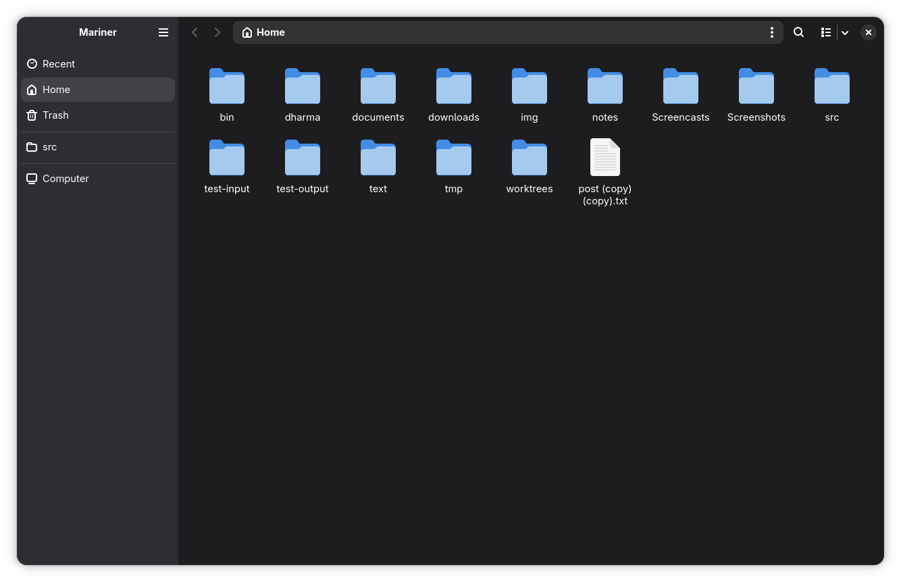

<h1 align="center">
  Mariner
</h1>

<p align="center">
  <b>GNOME Files, plus everything the issue tracker rejected.</b>
</p>

<p align="center">
  <a href="#the-big-features">Features</a> ·
  <a href="#everything-thats-different-from-gnome-files">vs. GNOME Files</a> ·
  <a href="#not-yet-supported">Not yet supported</a> ·
  <a href="#install">Install</a> ·
  <a href="#usage">Usage</a> ·
  <a href="#contributing">Contributing</a>
</p>

Mariner is a GTK4 + libadwaita file manager for the GNOME desktop. It
drives the same widgets as [GNOME Files](https://gitlab.gnome.org/GNOME/nautilus)
(Nautilus), so it looks and behaves like home — then adds type-to-select find,
dual-pane browsing, a Quick Look preview, a command palette, full-text search,
and a built-in disk analyzer on top.

<p align="center">
  
  <!-- screenshot placeholder — drop docs/hero.png here -->
</p>

## Why switch?

You already know how to use Mariner: the sidebar, breadcrumbs, tabs, grid/list
views, right-click menus, and keyboard shortcuts all match GNOME Files. Nothing
to relearn.

The difference is everything Nautilus users have asked for and never got — typeahead,
split view, a Space-bar preview, a command palette, real full-text search — shipped in
one app that still looks like stock GNOME.

---

## The big features

### Type-ahead navigation

Just start typing and Mariner navigates straight to the matching file. This innovative
feature is now available on the GNOME desktop!

### Dual-pane split view

Two folders side by side, so you can copy, move, or drag files from one to the
other without juggling windows. The most-requested GNOME Files feature — no more
reaching for Krusader or Total Commander.

- Toggle split: **F3**
- Copy to other pane: **Ctrl+Shift+C** · Move to other pane: **Ctrl+Shift+X**

<p align="center">
  
  <!-- screenshot placeholder — drop docs/split-view.png here -->
</p>

### Quick Look preview

Press **Space** on any file to preview it instantly — images, video, audio, text,
and code — without opening a heavy app. Arrow keys step through the rest of the
folder. It's Finder's best trick, built right in.

<p align="center">
  
  <!-- screenshot placeholder — drop docs/quicklook.png here -->
</p>

### Command palette

Press **Ctrl+P** to run any command or jump to a folder you've visited — like VS
Code, for your files. Just type a few letters; the folders you use most float to
the top, so what you want is usually the first hit.

<p align="center">
  
  <!-- screenshot placeholder — drop docs/command-palette.png here -->
</p>

### Full-text search

Search a whole folder tree, with matches appearing as they're found. Turn on
**Contents** to search *inside* files with [ripgrep](https://github.com/BurntSushi/ripgrep) —
fast, with nothing to index first. Narrow results by type (images, documents,
music, video…) or by date.

- Search: **Ctrl+F**

### Built-in disk usage analyzer

Right-click any folder → **Analyze Disk Usage** to see what's eating your space as
a colourful sunburst chart. Click a wedge to drill in. No separate app to install.

<p align="center">
  
  <!-- screenshot placeholder — drop docs/disk-usage.png here -->
</p>

---

## Everything that's different from GNOME Files

Beyond the headliners above, a low-density rundown of what Mariner does that
Nautilus doesn't (or does differently):

- **Type-ahead find** — type to jump straight to a file, like Nautilus used to.
- **Split view** — two panes in one tab, with cross-pane copy/move and drag.
- **Quick Look** — Space-to-preview for images, audio/video, text and code.
- **Command palette** — Ctrl+P to run any action or jump to a folder.
- **Frecency folder jumping** — recent folders ranked by frequency × recency.
- **Full-text search** — grep inside files via ripgrep, no indexing daemon.
- **Disk usage analyzer** — interactive sunburst chart, built in.
- **Computer view** — every drive and partition with a live capacity bar.
- **Vim cursor keys** — `Alt+H`/`J`/`K`/`L` move the selection like arrows.
- **Operations queue** — each running copy/move/archive shown separately, with its
  own progress and cancel button.
- **Batch rename** — find-and-replace or numbered patterns, with live preview.
- **Extract & compress** — extract zip, tar.*, 7z and rar; compress to zip,
  tar.*, or 7z, straight from the right-click menu.
- **Reset zoom** — `Ctrl+0` snaps grid icons back to the default size.
- **Set as wallpaper**, **Open in Terminal**, **Create Link**, **Restore from
  Trash** — one click from the context menu.

Everything else — tabs, bookmarks, the places sidebar, trash, undo/redo,
thumbnails, properties, sorting, hidden-file toggle, drag-and-drop, customizable
list columns — works just like GNOME Files.

---

## Not yet supported

Mariner is young, and a few things GNOME Files does haven't landed yet:

- **Network & remote locations** — no SMB/Windows shares, SFTP/SSH, FTP, WebDAV,
  or NFS; no MTP phones or cloud accounts; and no *Connect to Server* or *Other
  Locations* browser. Mariner sees only local disks and already-mounted volumes.
- **Reordering or labelling bookmarks** — bookmarks can be added and removed,
  but reordering them or assigning custom labels isn't wired up yet.
- **Custom actions** — user-defined commands in the file-view context menu are
  planned but not implemented yet.
- **Starred files** — there's no star/unstar action and no Starred view.
- **Editing permissions** — the Properties dialog shows an item's permissions but
  can't yet change them (no read/write/execute toggles).

These are on the roadmap rather than out of scope — see
[CONTRIBUTING.md](CONTRIBUTING.md) if you'd like to help.

---

## Install

### Flatpak (TunaOS remote)

This repository is the TunaOS fork of Mariner — the fork is published as a
Flatpak on the TunaOS remote:

```sh
flatpak remote-add --if-not-exists tuna-os https://tunaos.org/flatpak/tuna-os.flatpakrepo
flatpak install tuna-os org.tunaos.mariner
```

### Arch Linux (AUR)

> The `mariner-git` AUR package builds the **upstream** project
> (romgrk/mariner), not this fork. For the TunaOS fork, use the Flatpak above.

```sh
# with an AUR helper
paru -S mariner-git      # or: yay -S mariner-git

# or manually
git clone https://aur.archlinux.org/mariner-git.git && cd mariner-git
makepkg -si
```

Mariner then appears in your application menu. To make it your default file
manager:

```sh
xdg-mime default org.tunaos.mariner.desktop inode/directory
```

### From source

Requires **Node ≥ 22.18**, **GTK ≥ 4.16**, and **libadwaita ≥ 1.5**, plus a C
toolchain and the GTK / GObject-Introspection headers (to build the native
bindings on first install). [ripgrep](https://github.com/BurntSushi/ripgrep) is
optional — it enables full-text (in-file) search.

```sh
git clone https://github.com/tuna-os/mariner.git && cd mariner
npm install      # fetches and builds node-gtk
npm start
```

## Usage

Launch Mariner from your application menu, or open a folder from the terminal:

```sh
mariner ~/Documents          # installed
npm start -- ~/Documents     # from source
```

Press **Ctrl+?** at any time for the full keyboard-shortcuts window. A few worth
knowing up front:

| Shortcut | Action |
| --- | --- |
| **Ctrl+P** | Command palette |
| **Ctrl+F** | Search (add **Contents** filter for full-text) |
| **Space** | Quick Look preview |
| **F3** | Toggle split view |
| **F6** / **Alt+W** | Focus the other pane |
| **Ctrl+L** | Type a path |
| **Ctrl+1** / **Ctrl+2** | List / grid view |
| **F2** | Rename (batch rename with a multi-selection) |

## Contributing

Mariner is written in TypeScript on top of
[node-gtk](https://github.com/romgrk/node-gtk), with no build step. See
[CONTRIBUTING.md](CONTRIBUTING.md) for the architecture overview and development
notes.

## License

[GPL-3.0-or-later](LICENSE) © Rom Grk
