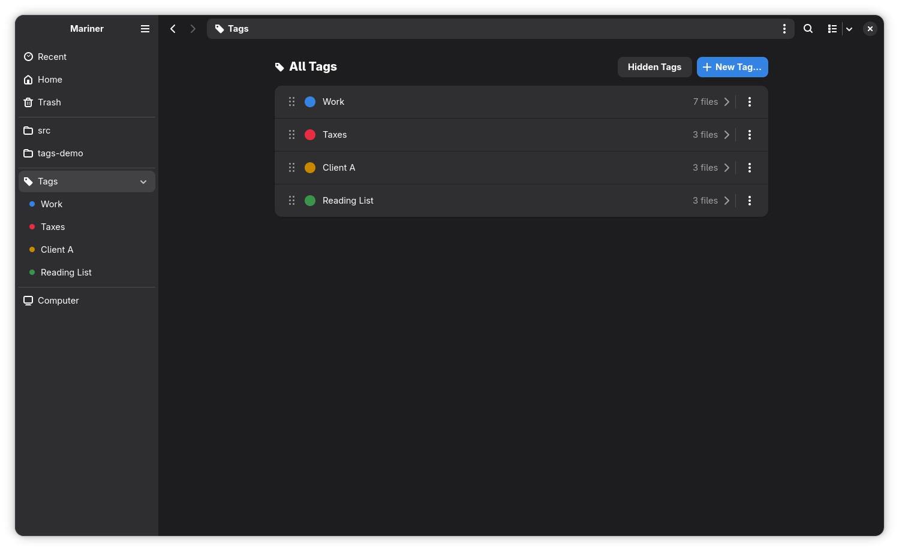

<div align="center">
  
 
  <h1 align="center">
    Mariner
  </h1>
</div>

<p align="center">
  <b>GNOME Files, plus everything the issue tracker rejected.</b>
</p>

<p align="center">
  <a href="#the-big-features">Features</a> ·
  <a href="#everything-thats-different-from-gnome-files">vs. GNOME Files</a> ·
  <a href="#not-yet-supported">Not yet supported</a> ·
  <a href="#install">Install</a> ·
  <a href="#usage">Usage</a> ·
  <a href="#contributing">Contributing</a>
</p>

Mariner is a GTK4 + libadwaita file manager for the GNOME desktop. It
drives the same widgets as [GNOME Files](https://gitlab.gnome.org/GNOME/nautilus)
(Nautilus), so it looks and behaves like home — then adds type-to-select find,
dual-pane browsing, a Quick Look preview, a command palette, full-text search,
file tags, and a built-in disk analyzer on top.

<p align="center">
  
  <!-- screenshot placeholder — drop docs/hero.png here -->
</p>

## Why switch?

You already know how to use Mariner: the sidebar, breadcrumbs, tabs, grid/list
views, right-click menus, and keyboard shortcuts all match GNOME Files. Nothing
to relearn.

The difference is everything Nautilus users have asked for and never got — typeahead,
split view, a Space-bar preview, a command palette, real full-text search — shipped in
one app that still looks like stock GNOME.

---

## The big features

### Type-ahead navigation

Just start typing and Mariner navigates straight to the matching file. Matching
is fuzzy and typo-tolerant: `dcmnts` finds `Documents`, and a slipped keystroke
like `Documnets` still lands on it. This innovative feature is now available on
the GNOME desktop!

### Dual-pane split view

Two folders side by side, so you can copy, move, or drag files from one to the
other without juggling windows. The most-requested GNOME Files feature — no more
reaching for Krusader or Total Commander.

- Toggle split: **F3**
- Copy to other pane: **Ctrl+Shift+C** · Move to other pane: **Ctrl+Shift+X**

<p align="center">
  
  <!-- screenshot placeholder — drop docs/split-view.png here -->
</p>

### Quick Look preview

Press **Space** on any file to preview it instantly — images, video, audio, text,
and code — without opening a heavy app. Arrow keys step through the rest of the
folder. It's Finder's best trick, built right in.

<p align="center">
  
  <!-- screenshot placeholder — drop docs/quicklook.png here -->
</p>

### Command palette

Press **Ctrl+P** to run any command or jump to a folder you've visited — like VS
Code, for your files. Just type a few letters; the folders you use most float to
the top, so what you want is usually the first hit.

<p align="center">
  
  <!-- screenshot placeholder — drop docs/command-palette.png here -->
</p>

### Command runner

Type `!` in the location bar (**Ctrl+L**) to run a shell command right in the
folder you're looking at — `git status`, unzip something, a quick `convert`.
Output streams into a panel at the bottom of the window (**Escape** closes it);
a command that finishes quietly is just a toast, and the view refreshes by
itself. Prefer a real terminal? `!!command` runs it in your terminal app and
keeps the window open afterwards — and a bare `!!` simply opens a terminal
here. Which terminal that is (also used by **Open in Terminal**) is
configurable in Preferences.

https://github.com/user-attachments/assets/dacec275-0a2b-4e5b-8ab8-3a60401cb881

### Full-text search

Search a whole folder tree, with matches appearing as they're found. Turn on
**Contents** to search _inside_ files with [ripgrep](https://github.com/BurntSushi/ripgrep) —
fast, with nothing to index first. Narrow results by type (images, documents,
music, video…) or by date.

- Search: **Ctrl+F**

### Built-in disk usage analyzer

Right-click any folder → **Analyze Disk Usage** to see what's eating your space as
a colourful sunburst chart. Click a wedge to drill in. No separate app to install.

<p align="center">
  
  <!-- screenshot placeholder — drop docs/disk-usage.png here -->
</p>

### Tags

Give files colored tags straight from the right-click menu, then pull up
everything with that label from the sidebar — wherever the files actually live.
Tags are stored in the standard `user.xdg.tags` extended attribute, so they
follow files when you copy them and stay compatible with KDE Dolphin. Not a
tags person? A single switch in Preferences hides them everywhere — your tag
data stays intact.

The design follows the GNOME Design team's
[tags whiteboard](https://gitlab.gnome.org/Teams/Design/whiteboards/-/work_items/332) —
credit to them for the mockups this feature is based on.

<p align="center">
  
</p>

### Custom actions

Add your own commands to the right-click menu — open a project in your editor,
optimize the selected images, run any script on what's selected. Define them in a
small JSON file and they show up automatically, shown only for the files they
apply to. See [Configuring custom actions](#configuring-custom-actions) for the
format.

<p align="center">
  
  <!-- screenshot placeholder — drop docs/custom-actions.png here -->
</p>

---

## Everything that's different from GNOME Files

Beyond the headliners above, a low-density rundown of what Mariner does that
Nautilus doesn't (or does differently):

- **Type-ahead find** — type to jump straight to a file, like Nautilus used
  to — but fuzzy and typo-tolerant.
- **Split view** — two panes in one tab, with cross-pane copy/move and drag.
- **Quick Look** — Space-to-preview for images, audio/video, text and code.
- **Command palette** — Ctrl+P to run any action or jump to a folder.
- **Frecency folder jumping** — recent folders ranked by frequency × recency.
- **Command runner** — `!command` in the location bar runs it in the current
  folder with output in a bottom panel; `!!command` runs it in your terminal.
- **Full-text search** — grep inside files via ripgrep, no indexing daemon.
- **Disk usage analyzer** — interactive sunburst chart, built in.
- **Folder sizes in the list view** — opt-in "calculate all sizes": the Size
  column shows real folder totals, cached so revisits are instant.
- **Configurable terminal** — Open in Terminal and `!!` spawn the emulator of
  your choice via a command template in Preferences.
- **Tags** — color-coded labels on files, browsable from the sidebar; stored as
  `user.xdg.tags` xattrs, interoperable with KDE Dolphin.
- **Clutter-free by choice** — hide any sidebar section (Recent, Trash, Tags,
  Devices…) from Preferences, or switch tags off entirely, so the window shows
  only what you actually use.
- **Custom actions** — add your own scripts to the context menu, matched to the
  selection by type, extension, or count.
- **Computer view** — every drive and partition with a live capacity bar.
- **Vim cursor keys** — `Alt+H`/`J`/`K`/`L` move the selection like arrows.
- **Operations queue** — each running copy/move/archive shown separately, with its
  own progress and cancel button.
- **Batch rename** — find-and-replace or numbered patterns, with live preview.
- **Extract & compress** — extract zip, tar._, 7z and rar; compress to zip,
  tar._, or 7z, straight from the right-click menu.
- **Reset zoom** — `Ctrl+0` snaps grid icons back to the default size.
- **Set as wallpaper**, **Open in Terminal**, **Create Link**, **Restore from
  Trash** — one click from the context menu.

Everything else — tabs, bookmarks, the places sidebar, trash, undo/redo,
thumbnails, properties, sorting, hidden-file toggle, drag-and-drop, customizable
list columns — works just like GNOME Files.

---

## Not yet supported

Mariner is young, and a few things GNOME Files does haven't landed yet:

- **Network & remote locations** — no SMB/Windows shares, SFTP/SSH, FTP, WebDAV,
  or NFS; no MTP phones or cloud accounts; and no *Connect to Server* or *Other
  Locations* browser. Mariner sees only local disks and already-mounted volumes.
- **Reordering or labelling bookmarks** — bookmarks can be added and removed,
  but reordering them or assigning custom labels isn't wired up yet.
- **Custom actions** — user-defined commands in the file-view context menu are
  planned but not implemented yet.
- **Starred files** — there's no star/unstar action and no Starred view.
- **Editing permissions** — the Properties dialog shows an item's permissions but
  can't yet change them (no read/write/execute toggles).

These are on the roadmap rather than out of scope — see
[CONTRIBUTING.md](CONTRIBUTING.md) if you'd like to help.

---

## Install

### Flatpak (TunaOS remote)

This repository is the TunaOS fork of Mariner — the fork is published as a
Flatpak on the TunaOS remote:

```sh
flatpak remote-add --if-not-exists tuna-os https://tunaos.org/flatpak/tuna-os.flatpakrepo
flatpak install tuna-os org.tunaos.mariner
```

### Arch Linux (AUR)

> The `mariner-git` AUR package builds the **upstream** project
> (romgrk/mariner), not this fork. For the TunaOS fork, use the Flatpak above.

```sh
# with an AUR helper
paru -S mariner-git      # or: yay -S mariner-git

# or manually
git clone https://aur.archlinux.org/mariner-git.git && cd mariner-git
makepkg -si
```

Mariner then appears in your application menu. To make it your default file
manager — both for opening folders _and_ for "Show in folder" from browsers,
download notifications and `gio open` (the `org.freedesktop.FileManager1`
interface):

```sh
xdg-mime default org.tunaos.mariner.desktop inode/directory
mariner-set-default            # undo with: mariner-set-default --undo
```

This sets the `inode/directory` MIME default and installs a per-user
`org.freedesktop.FileManager1` service (no root, no conflict with an installed
Nautilus). See [docs/default-file-manager.md](docs/default-file-manager.md) for
what it does and how to set it up by hand.

### npm / pnpm (global)

Requires **Node ≥ 22.18** and the GTK runtime libraries (**GTK ≥ 4.16**,
**libadwaita ≥ 1.5**, gobject-introspection). Prebuilt node-gtk binaries cover
x64 Linux on Node 22 / 24 / 26; other setups build node-gtk from source and
also need a C toolchain and the GTK / GObject-Introspection headers.

```sh
npm install -g github:romgrk/mariner    # or: pnpm add -g github:romgrk/mariner

mariner ~/Documents                     # run it
mariner --install-desktop-entry         # application menu entry + icon
```

`--install-desktop-entry` writes the desktop entry and icons under
`~/.local/share`, with `Exec=` pointing at this install's absolute paths (npm
global bin dirs are rarely on the desktop session's `PATH`). Run
`mariner --uninstall-desktop-entry` to remove them again — ideally before
uninstalling the package itself.

### From source

Requires **Node ≥ 22.18**, **GTK ≥ 4.16**, and **libadwaita ≥ 1.5**, plus a C
toolchain and the GTK / GObject-Introspection headers (to build the native
bindings on first install). [ripgrep](https://github.com/BurntSushi/ripgrep) is
optional — it enables full-text (in-file) search.

```sh
git clone https://github.com/tuna-os/mariner.git && cd mariner
npm install      # fetches and builds node-gtk
npm start
```

## Usage

Launch Mariner from your application menu, or open a folder from the terminal:

```sh
mariner ~/Documents          # installed
npm start -- ~/Documents     # from source
```

Press **Ctrl+?** at any time for the full keyboard-shortcuts window. A few worth
knowing up front:

| Shortcut                | Action                                         |
| ----------------------- | ---------------------------------------------- |
| **Ctrl+P**              | Command palette                                |
| **Ctrl+F**              | Search (add **Contents** filter for full-text) |
| **Space**               | Quick Look preview                             |
| **F3**                  | Toggle split view                              |
| **F6** / **Alt+W**      | Focus the other pane                           |
| **Ctrl+L**              | Type a path — or a `!` shell command           |
| **Ctrl+1** / **Ctrl+2** | List / grid view                               |
| **F2**                  | Rename (batch rename with a multi-selection)   |

### Configuring custom actions

You can add your own commands to the file-view context menu. Create
`~/.config/mariner/actions.json` (honouring `$XDG_CONFIG_HOME`) with a list of
actions:

```json
{
  "actions": [
    { "label": "Open in VS Code", "command": "code %F" },
    {
      "label": "Optimize PNGs",
      "command": "optipng %F",
      "mimeTypes": ["image/png"],
      "selection": "any"
    },
    {
      "label": "New note here",
      "command": "gnome-text-editor \"$(mktemp %d/note-XXXX.md)\"",
      "selection": "none"
    }
  ]
}
```

Each action needs a `label` and a `command`; the rest are optional and control
when the action appears:

| Field         | Meaning                                                           | Default |
| ------------- | ----------------------------------------------------------------- | ------- |
| `selection`   | `none` (empty area), `single`, `multiple`, or `any` selected item | `any`   |
| `mimeTypes`   | only when every selected item matches one of these globs          | any     |
| `extensions`  | only when every selected item has one of these extensions         | any     |
| `directories` | set to `false` to hide when a folder is selected                  | `true`  |
| `files`       | set to `false` to hide when a regular file is selected            | `true`  |

The `command` runs through `/bin/sh` from the current folder, with these tokens
substituted (each safely shell-quoted):

| Token | Expands to          | Token | Expands to         |
| ----- | ------------------- | ----- | ------------------ |
| `%f`  | first selected path | `%F`  | all selected paths |
| `%u`  | first selected URI  | `%U`  | all selected URIs  |
| `%n`  | first selected name | `%N`  | all selected names |
| `%d`  | current folder path | `%%`  | a literal `%`      |

With nothing selected, `%f`/`%F`/`%u`/`%U` fall back to the current folder. The
file is re-read every time you open the context menu, so edits take effect
without restarting Mariner.

## Contributing

Mariner is written in TypeScript on top of
[node-gtk](https://github.com/romgrk/node-gtk), with no build step. See
[CONTRIBUTING.md](CONTRIBUTING.md) for the architecture overview and development
notes.

## License

[GPL-3.0-or-later](LICENSE) © Rom Grk
